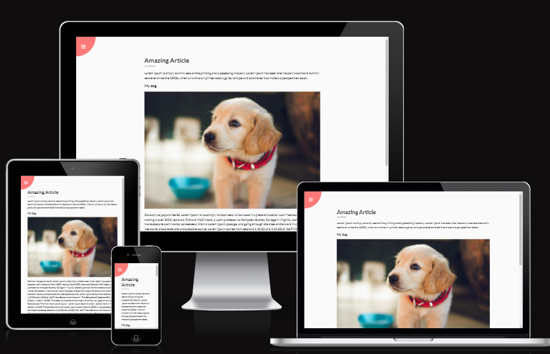

<h1 align="center">Rotating Navigation</h1>

You can view the deployed website [here](https://iris-smok.github.io/Rotating-Navigation/)

This is a project number 3 (Rotating Navigation) & 4 (Hidden Search Widget) from "50 projects In 50 Days" from Udemy Academy online course.
Project is made with HTML, CSS and JavaScript.